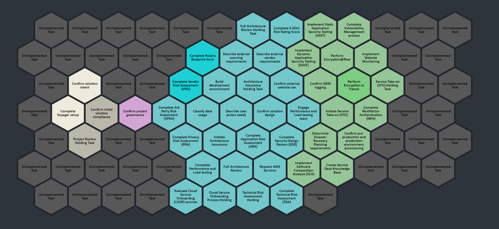

# HexGrid Visualizer

## Overview

Given an array of `taskNode` objects, the HexGrid Visualizer will draw a grid of hexagons to the screen with each object represented by an individual hexagon.

HexGrid is a React component, which uses the following libraries:

- [honeycomb-grid](https://abbekeultjes.nl/honeycomb/)

  - Provides the data structures `Hexagon`, `Grid` and `GridTraverser` which are used to handle the logic of a hexagon based grid.

- [react-konva](https://konvajs.org/docs/react/index.html)

  - Used for rendering the hexagon grid to an HTML canvas.

## Generating the Grid With Honeycomb

Honeycomb (`honeycomb-grid`) is a JavaScript library which provides the data constructs used for the creation and management of hexagon grids. There are a few limitations to this library which required some workarounds, however this library is by far the most full featured for the creation of hexagon grids.

 It is currently maintained, its GitHub can be found at https://github.com/flauwekeul/honeycomb and documentation at https://abbekeultjes.nl/honeycomb/.

### Creating a Hexagon Grid

A `Grid` object is a list of `Hex` objects - each `Hex` representing a unique hexagon in the grid.

Before creating a `Grid`, we need to first define the properties of the hexagons that make it up as so:

```js
const hex = defineHex({dimensions: {height: 80, width: 80}});
```

We then pass `hex` in as one of the arguments for constructing a new `Grid`:

```js
const grid = new Grid(hex);
```

We now have an empty grid, `grid`, to which we can add hexagons:

```js
grid.setHexes([
    {col: 0, row: 0},
    {col: 1, row: 0},
    {col: 2, row: 0}
    ]);
```


Alternately, when instantiating `grid`, we can pass in a _traverser_ such as `rectangle` to automatically populate the grid:

```js
const grid = new Grid(hex, rectangle({width: 4, height: 3}));
```


### Hexagon Grid Coordinates

Note that in the above two examples the hexagons have been labelled with their **offset coordinates**. Due to the nature of hexagon grids, there are a [number of ways to reference a hexagon's position in a grid](https://abbekeultjes.nl/honeycomb/guide/coordinate-system.html).

To get the **offset coordinates** of a hex you call the accessors `hex.col` and `hex.row`. Whereas to get the **axial coordinates** of a hex you call the accessors `hex.q` and `hex.r`. This is illustrated below:

Labelling hexagons with their **offset coordinates**:


Labelling hexagons with their **axial coordinates**:


For the sake of simplicity, when referencing grid coordinates I will continue using the **offset coordinates**.

### Traversing Grids

A **traverser** is a function that returns a list of hexes in a specific order. It can be thought of as an **ordered subset** of a larger grid.

```js
const grid = new Grid(hex, rectangle({width: 5, height: 5}));
const subGrid = grid.traverse(rectangle({start: {col: 1, row: 2}, width: 3, height: 3}));
```

`rectangle` is just the order in which hexagons are added to the grid. This can be illustrated like so:


There are a number of [built in traversers](https://abbekeultjes.nl/honeycomb/guide/traversing-grids.html#built-in-traversers) found in the Honeycomb library. Most useful is the `spiral` traverser, which given a point and a radius will add hexagons spiraling out from that center point:

```js
const grid = new Grid(hex, rectangle({width: 5, height: 5}));
const subGrid = grid.traverse(spiral({start: {col: 2, row: 2}, radius: 1}));
```


## Drawing Shapes

The Honeycomb library does **not** have any way of drawing a hexagons or a hexagon grid, it only provides the values to do so. This isn't much of a problem though and gives you options for how to implement the rendering of the hexagon grid.

In my implementation I make use of the [react-konva](https://konvajs.org/docs/react/index.html) library which lets you declaratively create **canvas** components in React.

### Drawing a Rectangle

First we create our `Stage` which will contain all canvas elements that are drawn to screen:

```jsx
<Stage width={window.innerWidth} height={window.innerHeight}>
</Stage>
```

Shapes must then be drawn to a `Layer`. Multiple shapes can be part of the same layer. This will be discussed further later on. Here we draw a simple rectangle:

```jsx
<Stage width={window.innerWidth} height={window.innerHeight}>
    <Layer>
        <Rect
        x={0}
        y={0}
        width={100}
        height={100}
        fill="#8ed89d"
        stroke="black"
        />
    </Layer>
</Stage>
```


### Drawing multiple shapes

One layer can contain multiple shapes. Elements are drawn as they are declared - overlapping anything previously drawn:

```jsx
<Stage width={window.innerWidth} height={window.innerHeight}>
            <Layer>
              <Rect
              x={0}
              y={0}
              width={100}
              height={100}
              fill="#8ed89d"
              stroke="black"
              strokeWidth={4}
              />
              <Rect
              x={40}
              y={40}
              width={100}
              height={100}
              fill="#fbb07c"
              stroke="black"
              strokeWidth={4}
              />
            </Layer>
          </Stage>
```


### Making Shapes Reactive

You can make canvas elements reactive by attaching an event - similar to any other React component. Below we create a `Rect` element which will change colour when clicked:

```jsx
const [ clicked, setClicked ] = useState(false);
var fillColor = clicked ? "#8ed89d" : "#fbb07c"

    return (
        <div>
          <Stage width={window.innerWidth} height={window.innerHeight}>
            <Layer>
              <Rect
              x={40}
              y={40}
              width={100}
              height={100}
              fill={fillColor}
              stroke="black"
              strokeWidth={4}
              onClick={() => setClicked(clicked ? false : true)}
              />
            </Layer>
          </Stage>
        </div>
      );
```


### Drawing a Hexagon

Each `Hex` object has an array of coordinate objects - one for each corner of the hexagon. These represent points for drawing the hexagon to screen:

```js
const hex = grid.createHex({col: 0, row: 1});
const corners = hex.corners;    
console.log(corners);
// Returns an array of coordinate objects, one for each hexagon corner
```

To draw a hexagon on the screen we pass an array of points to `react-konva`'s `Line` shape. As such we first need to convert `corners` from an array of coordinates to an array of numbers:

```js
const cornerCoords = []
corners.map((coord) => (cornerPoints.push(coord.x, coord.y)));
```

We can now draw a `Line` shape:

```js
return (
        <div>
          <Stage width={window.innerWidth} height={window.innerHeight}/>
            <Layer>
              <Line
              points={cornerCoords}
              fill="#fbb07c"
              closed={true}
              stroke="black"
              strokeWidth={4}
              />
            </Layer>
          </Stage>
        </div>
      );
```


Note that `react-konva` has a built in `RegularPolygon` shape which is capable of drawing a hexagon. However I found I couldn't get it working with the grid generated by `honeycomb` due to differences in how hexagon dimensions are interpreted by each library.

### Hexagon Component

I have created my own component `<Hexagon/>` which given a coordinate and dimensions, will use the `<Line/>` to draw a hexagon to screen:

```js
export function Hexagon(props){
  const cornerPoints = getHexCorners(props.origin, props.width, props.height);

  return (
    <Line
    points={cornerPoints}
    fill={props.color}
    closed={true}
    stroke={COLOR_STROKE_NORMAL}
    strokeWidth={props.stroke ?? 5}
    shadowEnabled={props.shadow ?? false}
    shadowColor={"black"}
    shadowBlur={15}
    shadowOpacity={0.6}
    />
  );
}
```

`<Hexagon/>` is used as a base for other components used in `HexGrid` such as `<HexCell/>` which adds a label using `Konva`'s `<Text/>` component and groups them together with the `<Group/>` component:

```js
// components/HexCell.js
export function HexCell(props){
  // Start label bounding box in the top left (north-west) corner of the hex
  const labelCoords = props.hex.corners[4];
  return (
    <Group
    center={props.hex.center}
    onMouseEnter={() => {
        if (props.clickedHex === null) {
            props.setHoverHex(props)
        }            
    }}>
      <Hexagon 
      width={props.hex.width} 
      height={props.hex.height} 
      origin={props.hex.corners[4]} 
      color={props.color}
      shadow={false}
      />
      <HexLabel 
      text={props.title}
      // 
      coords={labelCoords}
      width={props.hex.width}
      height={props.hex.height/2}
      fontSize={11}
      />   
    </Group>
  );
}
```

`HexCell` has an event listener which sets itself to the `hoverHex` when hovered over, using the `setHoverHex` function passed down from the parent component as a prop:

```js
// components/HexCell.js:11-15
onMouseEnter={() => {
        if (props.clickedHex === null) {
            props.setHoverHex(props)
        }            
    }}>
```

When hovered over the hexagon the `onMouseEnter` event listener sets the state value of `hoverHex` to itself which updates the parent component, `HexGrid`, and renders a larger hexagon over the top:

```js
// components/HexGrid.js:35-45
<Layer>
  {hoverHex && <HexagonHover
    coords={hoverHex.hex.corners[4]}
    width={hoverHex.hex.width}
    height={hoverHex.hex.height}
    scale={1.2}
    text={hoverHex.title}
    color={hoverHex.color}
    clickedHex={clickedHex} setClickedHex={setClickedHex}
    />}
</Layer>
```


### Drawing a Hexagon Grid

Because a `Grid` object is just a list of `Hex` objects, we can draw a whole grid by simply iterating over it and rendering each hexagon:

```js
  const hex = defineHex({dimensions: {height: 80, width: 80}});
  const grid = new Grid(hex, rectangle({width: 4, height: 4}));
  const render = [];

  grid.forEach((hexagon) => {
    // Add all corner points to a single array
    const cornerCoords = [];
    hexagon.corners.map((coord) => cornerCoords.push(coord.x, coord.y));
    // `render` will contain an array of Line components
    render.push(<Line
      points={cornerCoords}
      fill="#fbb07c"
      closed={true}
      stroke="black"
      strokeWidth={4}
    />)
  });

  // Render all hexagons to a canvas; 
    return (
        <div>
          <Stage width={window.innerWidth} height={window.innerHeight}>
            <Layer>
              {render}
            </Layer>
          </Stage>
        </div>
      );
```


You'll find that when running this code that part of the grid is rendered off screen, this can be solved by passing in an `origin` option to the `defineHex` method as so:

```js
const hex = defineHex({dimensions: {height: 80, width: 80}, origin='topLeft'});
```

## HexGrid Implementation

The HexGrid Visualizer reads in task data from `progressMapElements.js` and associates each task with a hexagon in the grid. This mapping is represented by the variable `TaskHexagons` an array of objects, each containing a `taskNode` object as well as associated `Hex` object. 

### Populate Task Hexagons

Instantiate the `Hex` and `Grid` objects which will be used to track the logical hexagon grid:

```js
// HexagonLogic.js:61-72
const hex = defineHex({
    dimensions: {
        height: HEX_HEIGHT,  
        width: HEX_WIDTH
    }, 
    origin: 'topLeft'
});
const grid = new Grid(hex, rectangle({
    width: GRID_WIDTH, 
    height: GRID_HEIGHT
}));
```

Import data from `progressMapElements`. For each `taskNode` object, create a new taskHexagon object (an object containing relevant task properties as well as a corresponding `Hex` object):

```js
// HexagonLogic.js:76-8984
const taskHexagons = [];
elements.taskNodes.forEach((taskNode) => {
        taskHexagons.push({
            hex: null,
            title: taskNode.data.title,
            color: getPhaseColor(taskNode.data.parent, taskNode.data.status),
            phase: taskNode.data.parent,
        });
    });
```

### Group Task Hexagons By Phase

To group task hexagons with the same phase we will make use of `honeycomb`'s grid traversers. For each phase create a `spiral` traverser and then convert it to an array:

```js
// HexagonLogic.js:88-92
const planPhaseTraverser = grid.traverse(spiral({
  start: [5, GRID_HEIGHT/2], 
  radius: 5
})).toArray();

const buildPhaseTraverser = grid.traverse(spiral({
  start: [9,GRID_HEIGHT/2], 
  radius: 6
})).toArray();

const initPhaseTraverser = grid.traverse(spiral({ 
  start: [0, GRID_HEIGHT/2], 
  radius: 1
})).toArray();

const govPhaseTraverser = grid.traverse(spiral({
  start: [2, GRID_HEIGHT/2], 
  radius: 1
})).toArray();

const unimplementedTraverser = grid.traverse(rectangle({
  start: [1, 1], 
  width: GRID_WIDTH, 
  height: GRID_HEIGHT
})).toArray();
```

Currently the starting point for each traverser is a hard coded value, however this could be made dynamic in the future.

We now map each phase to its corresponding traverser:

```js
// HexagonLogic.js:94-100
const phaseMap = new Map([
    ["Initiation", initPhaseTraverser], 
    ["Governance", govPhaseTraverser], 
    ["Plan & Design", planPhaseTraverser], 
    ["Build, Test & Deploy", buildPhaseTraverser], 
    ["Unimplemented", unimplementedTraverser]
]);
```

Iterate through `taskHexagons`. For each task, determine where its hexagon will be positioned on the grid by checking if the next available coordinate in the traverser is `null`. We can then set `task.hex` for this task.

```js
// HexagonLogic.js:102-110
taskHexagons.forEach(task => {
        const traverser = phaseMap.get(task.phase)
        var point = traverser.shift();
        while (checkGridForTask(taskHexagons, point) === true){
            point = traverser.shift();
        }
        const newHex = grid.createHex(point);
        task.hex = newHex;
    });
```

At this point all the task hexagons have a set position on the grid, which component `<HexGrid/>` will draw to screen.

### Render HexGrid Component

The `HexGrid` component calls the above code with `getTaskHexagons`:

```js
// components/HexGrid.js:14
const taskHexagons = getTaskHexagons();
```

`HexGrid` then iterates over `taskHexagons` and pushes a new `HexCell` component to the array `render` for every taskHexagon:

```js
// components/HexGrid.js:18-28
    const render = [];

    taskHexagons.forEach((task) => {
        render.push(<HexCell 
            hex={task.hex} 
            data={task.data}
            title={task.title}
            color={task.color} 
            hoverHex={hoverHex} 
            setHoverHex={setHoverHex} 
            clickedHex={clickedHex}
            />);
    });
```

`HexGrid` then returns a `Konva` `Stage`, `Layer` as well as all the `HexCell`s in `render`:

```js
// components/HexGrid.js:32-47
return(
  <Stage width={window.innerWidth} height={window.innerHeight}>
      <Layer>
        {render}
      </Layer>
```


There are two more reactive elements layered on top which add some interactivity for when hovering over a hexagon:

```js
// components/HexGrid.js:38-47
<Layer>
  {hoverHex && <HexagonHover
    coords={hoverHex.origin}
    width={hoverHex.width}
    height={hoverHex.height}
    scale={1.2}
    text={hoverHex.title}
    color={hoverHex.color}
    clickedHex={clickedHex} setClickedHex={setClickedHex}
    />}
</Layer>
```



And when a hexagon is clicked on:

```js
// components/HexGrid.js:48-57
<Layer>
  {clickedHex && <HexagonExpand
    coords={{x: (clickedHex.coords.x), y: (clickedHex.coords.y)}}
    width={400}
    height={440}
    text={clickedHex.text}
    color={clickedHex.color}
    clickedHex={clickedHex} setClickedHex={setClickedHex}
  />} 
</Layer>
```


## Further Improvements

- Find a way of dynamically calculating values which are currently hardcoded such as the grid size and traverser start positions.
- Add other UI components present in the mock-up.
- Implement the reactivity in a way that doesn't make it so that the grid has to be recalculated every time you hover over/ click on a hexagon. Currently the grid is not in a very optimized state as it repopulates the taskHexagons and redraws them every time the state changes.
- Add some nice animation transitions to things like the hexagons popping up.

## References

[honeycomb-grid website](https://abbekeultjes.nl/honeycomb/)

[honeycomb-grid docs & API](https://abbekeultjes.nl/honeycomb/guide/getting-started.html)

[react-konva docs](https://konvajs.org/docs/react/index.html)

[Hexagon grid theory reference](https://www.redblobgames.com/grids/parts/#hexagons)
