# HexGrid Visualizer

## Introduction

This is a prototype made as part of an investigation into whether we could
create a UI component of an interactive hexagonal grid. In this grid of
hexagons, each hexagon would represent a **process** in Voyager. A mock-up given
to us by MMC can be seen below:

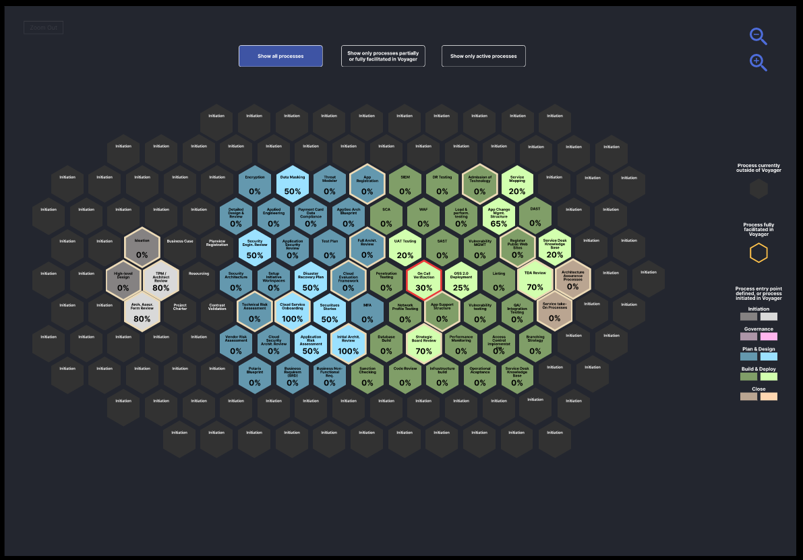

During this investigation, I used task data from the **taskGraph** to stand in for
what would be process data. As such in this prototype each hexagon will
represent a task, with each task having a title, phase and status properties.

As shown, we would want the hexagons in this grid to be different colours
based on **phase** (eg. Initiation, Governance) and **status** (eg. Active,
Complete), and we would want hexagons of the same phase to be
grouped together on the grid.

## Overview

Given an array of `taskNode` objects, the HexGrid Visualizer will draw a grid
of hexagons to the screen with each task represented by an individual
hexagon.

HexGrid is a **React component**, which uses the following libraries:

- [honeycomb-grid](https://abbekeultjes.nl/honeycomb/)

  - Provides the data structures `Hexagon`, `Grid` and `GridTraverser` which
  are used to handle the logic of a hexagon based grid.

- [react-konva](https://konvajs.org/docs/react/index.html)

  - Used for rendering the hexagon grid to an HTML canvas.

## Generating the Grid With Honeycomb

Honeycomb (`honeycomb-grid`) is a JavaScript library which provides the data
constructs used for the creation and management of hexagon grids.

It is currently maintained and under an MIT license,
its GitHub repo can be found at
[https://github.com/flauwekeul/honeycomb](https://github.com/flauwekeul/honeycomb)
and documentation at
[https://abbekeultjes.nl/honeycomb/](https://abbekeultjes.nl/honeycomb/).

### Creating a Hexagon Grid

A `Grid` object is a list of unique `Hex` objects. Before creating a `Grid`, we
need to first define the properties of the hexagons that make it up as so:

```js
const hexProps = defineHex({dimensions: {height: 80, width: 80}});
```

We then pass `hexProps` in as one of the arguments for constructing a new
`Grid`:

```js
const grid = new Grid(hexProps);
```

We now have an empty `Grid`, `grid`, to which we can add hexagons:

```js
grid.setHexes([
    {col: 0, row: 0},
    {col: 1, row: 0},
    {col: 2, row: 0}
    ]);
```

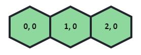

A `Grid` does not need to be contiguous, for example:

```js
grid.setHexes([
  {col: 0, row: 0},
  {col: 1, row: 0},
  {col: 3, row: 3}
]);
```

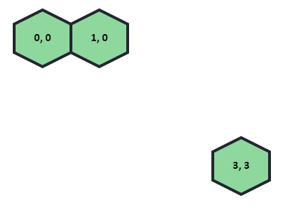

Alternately, when instantiating `grid`, we can pass in a
[traverser](#traversing-grids) such as
`rectangle` to automatically populate the grid:

```js
const grid = new Grid(hexProps, rectangle({width: 4, height: 3}));
```

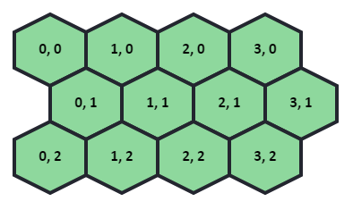

### Hexagon Grid Coordinates

Note that in the above two examples the hexagons have been labelled with their
**offset coordinates**. Due to the nature of hexagon grids, there are a
[number of ways to reference a hexagon's position in a grid](https://abbekeultjes.nl/honeycomb/guide/coordinate-system.html).

To get the **offset coordinates** of a hex you call the accessors `hex.col`
and `hex.row`. Whereas to get the **axial coordinates** of a hex you call the
accessors `hex.q` and `hex.r`. This is illustrated below:

Labelling hexagons with their **offset coordinates**:

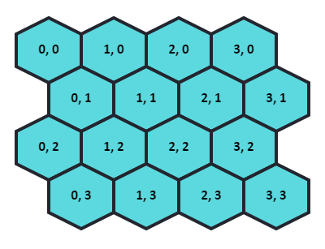

Labelling hexagons with their **axial coordinates**:

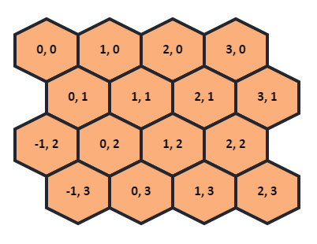

For the sake of simplicity, when referencing grid coordinates I will continue
using the **offset coordinates**.

### Traversing Grids

A **traverser** is a function that returns a list of hexes in a specific
order. It can be thought of as an **ordered subset** of a larger grid.

```js
const grid = new Grid(hex, rectangle({width: 5, height: 5}));
const subGrid = grid.traverse(rectangle({start: {col: 1, row: 2}, width: 3,
height: 3}));
```

`rectangle` is just the order in which hexagons are added to the grid. This
can be illustrated like so:

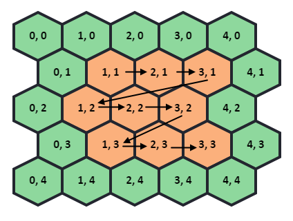

There are a number of [built in traversers](https://abbekeultjes.nl/honeycomb/guide/traversing-grids.html#built-in-traversers)
found in the Honeycomb library. Most useful is the `spiral` traverser,
which given a point and a radius will add hexagons spiraling out from that
center point:

```js
const grid = new Grid(hex, rectangle({width: 5, height: 5}));
const subGrid = grid.traverse(spiral({start: {col: 2, row: 2}, radius: 1}));
```

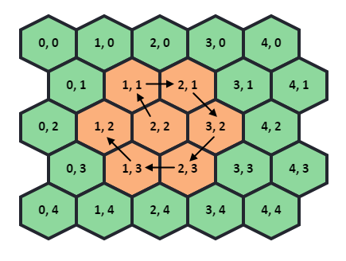

## Drawing Shapes

The Honeycomb library does not have any way of drawing hexagons or a
hexagon grid, it only provides the values to do so. This isn't much of a
problem though and gives you options for how to implement the rendering of
the hexagon grid.

In my implementation I make use of the
[react-konva](https://konvajs.org/docs/react/index.html) library which lets
you declaratively create **HTML canvas** based components in React. All diagrams
shown so far have been made using `react-konva`.

### Drawing a Rectangle

First we create our `Stage` which will contain all canvas elements that are
drawn to screen:

```jsx
<Stage width={window.innerWidth} height={window.innerHeight}>
</Stage>
```

Shapes must then be drawn to a `Layer`. Multiple shapes can be part of the
same `Layer`. This will be discussed further later on. Here we draw a simple
rectangle:

```jsx
<Stage width={window.innerWidth} height={window.innerHeight}>
    <Layer>
        <Rect
          x={0}
          y={0}
          width={100}
          height={100}
          fill="#8ed89d"
          stroke="black"
        />
    </Layer>
</Stage>
```

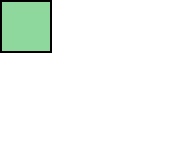

### Drawing multiple shapes

One layer can contain multiple shapes. Elements are drawn as they are
declared - overlapping anything previously drawn:

```jsx
<Stage width={window.innerWidth} height={window.innerHeight}>
  <Layer>
    <Rect
      x={0}
      y={0}
      width={100}
      height={100}
      fill="#8ed89d"
      stroke="black"
      strokeWidth={4}
    />
    <Rect
      x={40}
      y={40}
      width={100}
      height={100}
      fill="#fbb07c"
      stroke="black"
      strokeWidth={4}
    />
  </Layer>
</Stage>
```

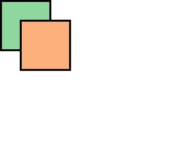

### Making Shapes Reactive

You can make canvas elements reactive by attaching an event handler - similar
to any other React component. Below we create a `Rect` element which will
change colour when clicked:

```jsx
const [ clicked, setClicked ] = useState(false);
var fillColor = clicked ? "#8ed89d" : "#fbb07c"

return (
  <div>
    <Stage width={window.innerWidth} height={window.innerHeight}>
      <Layer>
        <Rect
          x={40}
          y={40}
          width={100}
          height={100}
          fill={fillColor}
          stroke="black"
          strokeWidth={4}
          onClick={() => setClicked(clicked ? false : true)}
        />
      </Layer>
    </Stage>
  </div>
);
```

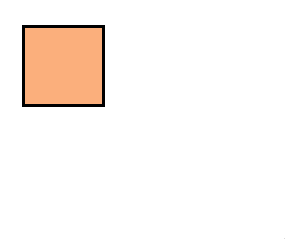

## Drawing a Hexagon

Each `Hex` object has an array of coordinate objects - one for each corner of
the hexagon. These represent points for drawing the hexagon to screen:

```js
const hex = grid.createHex({col: 0, row: 1});
const corners = hex.corners;    
console.log(corners);
// Returns an array of coordinate objects, one for each hexagon corner
```

To draw a hexagon on the screen we pass an array of points to
`react-konva`'s `Line` shape. As such we first need to convert `corners`
from an array of coordinates to an array of numbers:

```js
const cornerCoords = []
corners.map((coord) => (cornerPoints.push(coord.x, coord.y)));
```

We can now draw a `Line` shape:

```js
return (
  <div>
    <Stage width={window.innerWidth} height={window.innerHeight}/>
      <Layer>
        <Line
          points={cornerCoords}
          fill="#fbb07c"
          closed={true}
          stroke="black"
          strokeWidth={4}
        />
      </Layer>
    </Stage>
  </div>
);
```

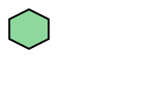

Note that `react-konva` has a built in `RegularPolygon` shape which is
capable of drawing a hexagon. However I found I couldn't get it working with
the grid generated by `honeycomb` due to differences in how hexagon
dimensions are interpreted by each library.

### Calculating Hexagon Corners

A limitation of `honeycomb-grid` is that all hexagons are tied down to a
fixed position on a grid. This makes it hard to draw individual hexagons
at a specific point on the screen because we rely on the `corners`
property of the `Hex` object.

To draw a hexagon in `react-konva` independent of the `honeycomb-grid`
library we implement our own way of calculating hexagon corners given a
coordinate and some dimensions.

To do so we define our **origin point** as the top left (north-west) corner.
Given the coordinates of the origin point along with the width and height, we
can then calculate the coordinates of all the other corners by using a fixed set
of ratios.

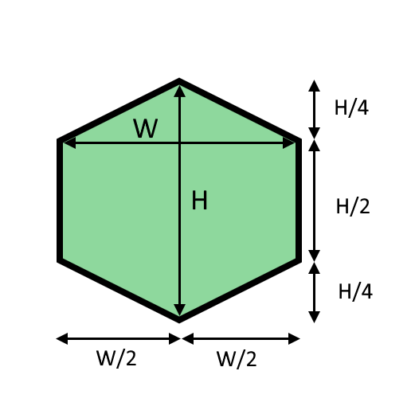

```js
// components/Hexagon.js
function getHexCorners(origin, width, height) {
  return [
    origin.x + width, // NE x-coordinate
    origin.y, // NE y-coordinate
    origin.x + width, // SE x-coordinate
    origin.y + 0.5 * height, // SE y-coordinate
    origin.x + 0.5 * width, // S x-coordinate
    origin.y + 0.75 * height, // S y-coordinate
    origin.x, // SW x-coordinate
    origin.y + 0.5 * height, // SW y-coordinate
    origin.x, // NW x-coordinate
    origin.y, // NW y-coordinate
    origin.x + 0.5 * width, // N x-coordinate
    origin.y - 0.25 * height, // N y-coordinate
  ];
}
```

### Hexagon Component

I have created my own component `<Hexagon/>` which calls the
`getHexCorners` method shown above. Given an origin coordinate and
dimensions, it will use `<Line/>` to draw a hexagon to screen:

```js
// components/Hexagon.js
export function Hexagon(props) {
  const cornerPoints = getHexCorners(props.origin, props.width, props.height);

  return (
    <Line
      points={cornerPoints}
      fill={props.color}
      closed={true}
      stroke={COLOR_STROKE_NORMAL}
      strokeWidth={props.stroke ?? STROKE_WIDTH_DEFAULT}
      shadowEnabled={props.shadow}
      shadowColor="black"
      shadowBlur={SHADOW_BLUR_SIZE}
      shadowOpacity={SHADOW_OPACITY}
      perfectDrawEnabled={false}
    />
  );
}
```

### Drawing a Hexagon Grid

Because a `Grid` object is just a list of `Hex` objects, we can draw a whole
grid by simply iterating over it and rendering each hexagon:

```js

  const hexProps = defineHex({dimensions: {height: 80, width: 80}});
  const grid = new Grid(hex, rectangle({width: 4, height: 4}));

  // Render all hexagons to a canvas
    return (
        <div>
          <Stage width={window.innerWidth} height={window.innerHeight}>
            <Layer>
              {grid.map((hexagon) => (
                <Hexagon
                  origin={hexagon.corners[4]} // Top left (NW) corner
                  width={hexagon.width}
                  height={hexagon.height}
                  color="#fbb07c"
                />
              ))}
            </Layer>
          </Stage>
        </div>
      );
```

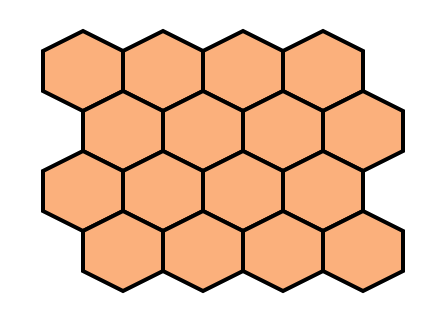

You'll find that when running this code that part of the grid is rendered off
screen, this can be solved by passing in an `origin` option of `'topLeft'` to
the `defineHex` method as so:

```js
const hexProps = defineHex({
  dimensions: {height: 80, width: 80}, 
  origin='topLeft'
});
```

## HexGrid Implementation

The HexGrid Visualizer reads in task data from `progressMapElements.js` and
associates each task with a hexagon in the grid. This mapping is represented
by the variable `TaskHexagons` an array of objects, each containing a
`taskNode` object as well as associated `Hex` object.

### Populate Task Hexagons

Instantiate the `Hex` and `Grid` objects:

```js
// HexagonLogic.js
const hex = defineHex({
    dimensions: {
        height: HEX_HEIGHT,  
        width: HEX_WIDTH
    }, 
    origin: 'topLeft'
});
const grid = new Grid(hex, rectangle({
    width: GRID_WIDTH, 
    height: GRID_HEIGHT
}));
```

Note that this `Grid` object is not what will be drawn to screen. This is just
a data structure that we will use for the sake of getting points on the
screen to which we will draw hexagons.

Next we create the traversers for each phase and then converting them to an array:

```js
// HexagonLogic.js
const planPhaseTraverser = grid
    .traverse(
      spiral({
        start: PLAN_TRAVERSER_ORIGIN_POINT,
        radius: PLAN_TRAVERSER_RADIUS,
      }),
    )
    .toArray();
  const buildPhaseTraverser = grid
    .traverse(
      spiral({
        start: BUILD_TRAVERSER_ORIGIN_POINT,
        radius: BUILD_TRAVERSER_RADIUS,
      }),
    )
    .toArray();
  const initPhaseTraverser = grid
    .traverse(
      spiral({
        start: INIT_TRAVERSER_ORIGIN_POINT,
        radius: INIT_TRAVERSER_RADIUS,
      }),
    )
    .toArray();
  const govPhaseTraverser = grid
    .traverse(
      spiral({
        start: GOV_TRAVERSER_ORIGIN_POINT,
        radius: GOV_TRAVERSER_RADIUS,
      }),
    )
    .toArray();
  const unimplementedTraverser = grid
    .traverse(
      rectangle({
        start: NO_TRAVERSER_ORIGIN_POINT,
        width: GRID_WIDTH,
        height: GRID_HEIGHT,
      }),
    )
    .toArray();
```

By doing so we create arrays of coordinates that are grouped together to which we
will assign hexagons of the same phase.

Currently this step is reliant on hard coded values, but work can be done to make
this dynamic by programmatically calculating the spacing and radius of each spiral.

The data being used for this prototype are the `taskNode` objects found in
`progressMapElements`. To determine **phase** we are interested in the
`taskNode.data.parent` property. Here we create a mapping between phase name
and each traverser:

```js
  const phaseMap = new Map([
    ['Initiation', initPhaseTraverser],
    ['Governance', govPhaseTraverser],
    ['Plan & Design', planPhaseTraverser],
    ['Build, Test & Deploy', buildPhaseTraverser],
    ['Unimplemented', unimplementedTraverser],
  ]);
```

We will use this mapping to simplify the assignment of `taskNodes` to `Hex` objects
based on phase.

Create an empty array `taskHexagons`:

```js HexagonLogic.js
const taskHexagons = [];
```

Each object in this array will represent a unique task and a corresponding
`Hex` object which will be represented by a `HexCell` component on screen.

Iterate through `taskNodes`. For each `taskNode`, determine where its hexagon
will be positioned on the grid by checking if the next available coordinate
in the traverser is `null`. To determine which traverser is used we use our mapping
from earlier:

```js
elements.taskNodes.forEach((taskNode) => {
  const traverser = phaseMap.get(taskNode.data.parent);
  let point = traverser.shift();
  while (checkGridForTask(taskHexagons, point)) {
    point = traverser.shift();
  }
  ...
```

To determine whether a hexagon already has a task assigned I have written the
method `checkGridForTask` which simply searches through `taskNodes` for a hexagon
with the given coordinates:

```js
//HexagonLogic.js
function checkGridForTask(taskGrid, point) {
  const allHexagons = taskGrid.map(({ hex }) => hex);
  const returnValue = allHexagons.some((hexagon) => hexagon !== null && hexagon.equals(point));
  return returnValue;
}
```

This ensures that if two traversers share a coordinate
a hexagon doesn't get reassigned with another task. On finding the next free
coordinate, we create `Hex` object `newHex` and then create a new object in
`taskHexagons` with `newHex` as the `hex` property. Other relevant properties
are taken from `taskNode.data`:

```js
elements.taskNodes.forEach((taskNode) => {
  ...
  const newHex = grid.createHex(point);
    taskHexagons.push({
      hex: newHex,
      id: taskNode.data.id,
      title: taskNode.data.title,
      color: getPhaseColor(taskNode.data.parent, taskNode.data.status),
      phase: taskNode.data.parent,
    });
```

At this point all the task hexagons have a set position on the grid, which
component `<HexGrid/>` will draw to screen.

### Render the HexGrid

#### The HexCell Component

The `HexCell` component is simply a `<Hexagon/>` with an added label, and event
listener which is used for reactive elements of the HexGrid
([see Reactive Elements](#reactive-elements)).

Each of the above taskHexagons is represented by a `<HexCell/>`. A number of
`<HexCell/>` components make up the `<HexGrid/>`.

#### The HexGrid Component

The parent component of `<HexGrid/>` will call getTaskHexagons`:

```js
// components/App.js
const taskHexagons = getTaskHexagons();
```

Which it then passes to `<HexGrid/>` as a prop:

```js
return (
    <div>
      <HexGrid tasks={taskHexagons} />
    </div>
  );
```

This is to prevent `<HexGrid/>` from having to recompute `getTaskHexagons` every
time its state changes. This can be done better, possibly with the `useMemo`
hook.

The `HexGrid` component returns a `Stage` and `Layer` which contains
a number of `HexCell` components - one for each `taskHexagon`:

```js
// components/HexGrid.js
return (
<Stage width={window.innerWidth} height={window.innerHeight}>
  <Layer>
    {taskHexagons.map((task) => (
      <HexCell
        key={task.hex}
        origin={task.hex.corners[TOP_LEFT_CORNER]}
        width={task.hex.width}
        height={task.hex.height}
        data={task.data}
        title={task.title}
        color={task.color}
        hoverHex={hoverHex}
        setHoverHex={setHoverHex}
        clickedHex={clickedHex}
      />
    ))}
  </Layer>
```

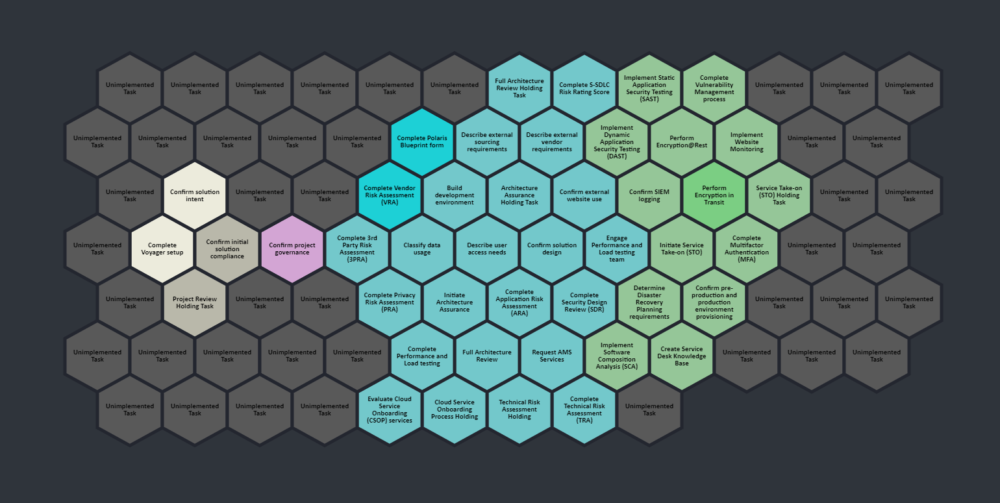

#### Reactive Elements

`HexCell` has an event listener which sets itself to the `hoverHex` when
hovered over, using the `setHoverHex` function passed down from the parent
component as a prop:

```js
// components/HexCell.js
onMouseEnter={() => {
        if (props.clickedHex === null) {
            props.setHoverHex(props)
        }            
    }}>
```

When hovered over the hexagon the `onMouseEnter` event listener sets the
state value of `hoverHex` to itself which updates the parent component,
`HexGrid`, and renders a larger hexagon over the top:

```js
// components/HexGrid.js
<Layer>
  {hoverHex && <HexagonHover
      coords={hoverHex.hex.corners[4]}
      width={hoverHex.hex.width}
      height={hoverHex.hex.height}
      scale={1.2}
      text={hoverHex.title}
      color={hoverHex.color}
      clickedHex={clickedHex}
      setClickedHex={setClickedHex}
    />}
</Layer>
```

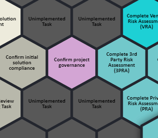

Similarly, `<HoverHex/>` has an event listener which, when clicked, will
display an expanded, more detailed version of the taskHexagon - `<HexagonExpand/>`.

```js
// components/HoverHex.js
<Group
  onClick={() => {
    props.setClickedHex(props.clickedHex ? null : props);
    setOpen((state) => !state);
  }}
```

```js
// components/HexGrid.js
<Layer>
  {clickedHex && (
    <HexagonExpand
      coords={{ x: clickedHex.coords.x, y: clickedHex.coords.y }}
      width={LARGE_HEX_WIDTH}
      height={LARGE_HEX_HEIGHT}
      text={clickedHex.text}
      color={clickedHex.color}
      clickedHex={clickedHex}
      setClickedHex={setClickedHex}
    />
  )}
</Layer>
```

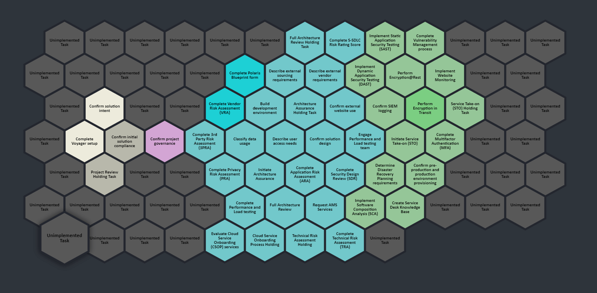

## Further Improvements

- Find a way of dynamically calculating values which are currently hardcoded
  such as the grid size and traverser start positions.
- Add other UI components present in the mock-up.
- Implement the reactivity in a way that doesn't make it so that the grid has
  to be re-rendered every time you hover over/ click on a hexagon.
  Currently the grid is not in a very optimized state as it redraws them every time the state changes.
- Add some nice animation transitions to things like the hexagons popping up.
- The mock-up shows a bit of padding between the hexagons, this is something we
  could implement as a prop of the `HexGrid` component.

## References

[honeycomb-grid website](https://abbekeultjes.nl/honeycomb/)

[honeycomb-grid docs & API](https://abbekeultjes.nl/honeycomb/guide/getting-started.html)

[react-konva docs](https://konvajs.org/docs/react/index.html)

[Hexagon grid theory reference](https://www.redblobgames.com/grids/hexagons/)
